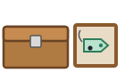
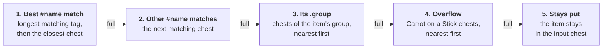

# GemsSorting

Item-frame driven chest sorting for our Paper 26.3 server: put an item frame on a chest, and the item inside
the frame decides what the chest does. A printable version of the player guide is in
[docs/Sorting-System-Guide.pdf](docs/Sorting-System-Guide.pdf) (source: [`docs/guide.html`](docs/guide.html)).

- [Player guide](#player-guide)
- [Item groups and the web editor](#item-groups-and-the-web-editor)
- [How it works](#how-it-works)
- [Configuration](#configuration)
- [Development](#development)

## Player guide

### The chest types

Place an **item frame on a chest** and put one of these items in the frame. The item decides what the chest does.

| | Chest | Frame holds | What it does |
|:-:|---|---|---|
|  | **Input chest** | an **Eye of Ender** | Anything you put in here is sorted **instantly**. It works with items dropped in by hand, hoppers and droppers. |
|  | **Receiver chest** | a **Name Tag** named `#code` | Collects every item with *code* in its name. For example `#Sapling` collects all saplings. |
|  | **Group chest** | a **Name Tag** named `.group` | Collects every item of a group made in the [web editor](#item-groups-and-the-web-editor). For example `.Redstone` collects repeaters, comparators, pistons, … |
|  | **Overflow chest** | a **Carrot on a Stick** | Gets the leftovers: items with no matching name tag, and items whose tagged chests are full. |

### Setting it up

1. **Place the input chest.** Put an item frame on one of its sides (sneak and right-click the chest) and put
   an **Eye of Ender** in the frame.
2. **Name a Name Tag in an anvil** so it starts with `#`, for example `#Sapling`, `#Log` or `#Diamond`.
3. **Place the receiver chests** within **128 blocks** of the input chest. Put a frame on each one with its
   named tag inside.
4. **Place at least one overflow chest** with a **Carrot on a Stick** in its frame, so unmatched items have
   somewhere to go.
5. **Drop items into the input chest.** They are sent out right away.

> [!NOTE]
> **Without an overflow chest**, items that don't match any tag stay in the input chest. Nothing is lost or deleted.

### Naming the tags

The text after `#` is looked up inside the item's name. Upper and lower case don't matter.

| Tag | Collects |
|---|---|
| `#Sapling` | Oak Sapling, Birch Sapling, Cherry Sapling, … (every sapling) |
| `#Oak Sapling` | Only Oak Sapling (Dark Oak Sapling too, since its name contains "Oak Sapling") |
| `#Log` | Every log, including stripped logs |
| `#Diamond` | Diamond, Diamond Block, Diamond Ore, Diamond Sword, Diamond Pickaxe, … |
| `#Seeds` | Wheat Seeds, Pumpkin Seeds, Melon Seeds, Beetroot Seeds, … |

> [!TIP]
> **Use the English item names.** If your game is set to another language, use the English name or the item ID
> instead. Press **F3 + H** to show item IDs when you hover over items. For example, `#oak_sapling` works the
> same as `#Oak Sapling`. Items renamed in an anvil are sorted by their **original** name.

### Where each item goes



**Example:** you have a `#Oak` chest and a `#Sapling` chest. An Oak Sapling matches both, and it goes to
`#Sapling` because that tag is longer. Oak Logs and Oak Planks go to `#Oak`.

**Names beat groups:** with a `#Repeater` chest and a `.Redstone` chest, repeaters go to `#Repeater` even if
they are in the Redstone group; comparators, pistons and the rest of the group go to `.Redstone`.

### Good to know

- **Range:** receiver and overflow chests must be within **128 blocks** of the input chest.
- **Stay nearby:** far-away chests in areas that aren't loaded are skipped. Their items go to the overflow
  chest instead.
- **Double chests** work. The frame can go on either half.
- Trapped chests and glow item frames work too. The frame can go on any side of the chest, including the top.
- You can have **several input chests**, and several chests with the same tag. When one fills up, the next one
  takes over.
- Changes to frames take up to **3 seconds** to take effect.
- Don't put an Eye of Ender on a receiver chest: that turns it into an input chest, and nothing gets sorted
  into it.
- **Nothing sorts?** Check that the name tag starts with `#` (or `.` for a group) and was renamed in an anvil,
  that the frame is on the chest itself, and that the chest is within 128 blocks. For a group, check that
  the name matches a group in the web editor.

## Item groups and the web editor

A **group** is a list of items chosen by hand, for things whose names have nothing in common: all the
redstone components, all the farm drops, all the ores, … A chest whose frame holds a name tag renamed
`.Name` collects the items of the group *Name* (upper and lower case don't matter). Every item belongs to at
most one group.

Groups are edited in the web interface, **for server operators only**:

1. In game (or from the server console) type **`/gems web`**. You get a personal login link, valid 5 minutes
   and usable once.
2. The browser then stays logged in for 30 days, as long as you are still an operator.

In the editor:

- **Language**: the interface and the item names are in English by default; the *Language* selector at the
  top switches everything to Italian (the choice is kept in a cookie for a year). Messages from the server
  follow the same choice, and `/gems web` answers in the language of the player's Minecraft client.
- **Search** works in both languages whatever the names are shown in (accents and the item id work too:
  `polvere`, `redstone dust`, `redstone`). The filters show all items, only those without a group, or only
  those in a group.
- **Drag and drop** items from the list into a group, from one group to another (the item moves), or back to
  the list (the item leaves its group). Items can also be reordered inside a group.
- **Click to add**: pick a group in *Click adds to* (or press *Select* on a group), then click items to
  add them; a second click removes them. While searching, *Add N results* adds all results at once.
- Every change is **saved automatically** and can be undone (*Undo* or Ctrl+Z). *Copy* copies the
  `.Name` to rename the tag with. If two people edit at the same time, the second save is refused and the
  page reloads the latest version.

Changes apply to the next items sorted: there is no need to touch the chests or the frames.

## How it works

- Anything that may put items into a chest (click, drag, closing the inventory, hoppers, droppers, hopper
  minecarts) schedules a sort of that chest for the next tick. The chest is sorted only if it has an
  Eye of Ender frame.
- Matching is a case-insensitive substring of the item's English name or its id (`oak_sapling`); anvil
  names are ignored.
- Targets are ordered: `#name` receivers by tag length (longest first) then distance from the input chest,
  then the `.group` chests of the item's group (nearest first), then the overflow chests (nearest first).
  A full chest spills over to the next target; what is left stays in the input chest.
- Groups are stored in `plugins/GemsSorting/groups.json` and looked up when each item is sorted, so edits in
  the web editor apply immediately.
- The scan of frames around an input chest is cached for about 3 seconds. Only loaded chunks are scanned.

## Configuration

`plugins/GemsSorting/config.yml`:

| Key | Default | Meaning |
|---|---|---|
| `radius` | `128` | Max distance (blocks) from an input chest to its receiver and overflow chests |
| `web.enabled` | `true` | Starts the group editor |
| `web.bind` | `0.0.0.0` | Address of the built-in web server |
| `web.port` | `8101` | Port of the web server; on Pterodactyl it must be an allocation of the server |
| `web.public-url` | `https://sorting.example.com` | Address used in the `/gems web` links; with `https://` the session cookie is `Secure` |
| `web.session-days` | `30` | How long a browser stays logged in |

Missing keys are added to an existing `config.yml` on startup.

Files in `plugins/GemsSorting/`:

| File | Content |
|---|---|
| `groups.json` | The groups (back it up with the world) |
| `sessions.json` | Web sessions (only hashes of the session tokens) |
| `cache/<version>-<n>/` | Item names and icon atlas, rebuilt automatically after a Minecraft update |

## Development

### Code layout

| File | What it does |
|---|---|
| `GemsSortingPlugin.java` | Entry point; reads `config.yml`, starts the web interface |
| `SortingListener.java` | Inventory events (click, drag, close, hopper move); schedules a sort of the touched chest |
| `SortingService.java` | Finds input, receiver, group and overflow chests via item frames and moves the items |
| `ItemNames.java` | Parses `#code` / `.group` name tags and matches item names |
| `GroupStore.java` | The groups: `groups.json`, validation (unique names, one group per item), versioning |
| `GemsCommand.java` | `/gems web`: login links for operators and the console |
| `Auth.java` | One-time login links, browser sessions, operator check |
| `WebServer.java` | Built-in HTTP server (JDK `HttpServer`): static files and JSON API |
| `Assets.java` | Downloads the Minecraft client once to get Italian names and icons; builds the icon atlas |
| `IconRenderer.java` | Draws inventory-style icons from the client's item models and textures |
| `resources/web/` | The editor: `index.html`, `app.js`, `i18n.js` (English and Italian texts), `app.css`, SortableJS (drag and drop) |

### Web interface

| Request | What it does |
|---|---|
| `GET /login?t=…` | Redeems a one-time link from `/gems web`, sets the session cookie and redirects to `/` |
| `GET /api/session` | Name of the logged-in user (401 if not logged in) |
| `POST /api/logout` | Ends the session |
| `GET /api/items` | Item catalog: id, English and Italian name, atlas index |
| `GET /api/groups` | Groups and their version |
| `PUT /api/groups` | Replaces all groups; 409 if the version is not the latest, 400 if invalid |
| `GET /atlas.png?v=…` | All icons in one image (64 px cells, 48 per row), cached for 30 days |

Security: login links and session tokens are 256-bit random values, stored only as SHA-256 hashes; links
expire after 5 minutes and work once. The session cookie is `HttpOnly`, `SameSite=Lax` and `Secure` behind
https. Every API call checks that the player is still an operator (cached for 30 s). Writes need the
`X-Gems: 1` header, which cross-site forms can't send.

Names and icons come from the official client jar of the server's Minecraft version (downloaded from
Mojang, checked against its SHA-1 and deleted after use) and the Italian language file from Mojang's asset
server. Blocks are drawn in the isometric inventory view; chests, shulker boxes, heads and banners have
dedicated drawings; a few special items (shields, tridents, statues) show a simplified icon.

### Build

Requirements: **JDK 25** (the Paper 26.3 API is compiled for Java 25; the plugin itself targets Java 21)
and Maven 3.9+.

```sh
mvn -DskipTests clean package
```

Without a local JDK, use Docker:

```sh
docker run --rm -u "$(id -u):$(id -g)" -v "$PWD":/src -v "$HOME/.m2":/m2 -w /src \
  maven:3.9-eclipse-temurin-25 \
  mvn -Duser.home=/tmp -Dmaven.repo.local=/m2/repository -DskipTests clean package
```

Output: `target/gems-sorting-<version>.jar`.

### Player guide PDF

After editing `docs/guide.html`, regenerate the PDF with headless Chrome. The DejaVu fonts are mounted so
that bold text renders:

```sh
docker run --rm -u "$(id -u):$(id -g)" -v "$PWD/docs":/docs \
  -v /usr/share/fonts/truetype/dejavu:/usr/share/fonts/dejavu:ro \
  --entrypoint chromium-browser zenika/alpine-chrome:124 \
  --headless --no-sandbox --disable-gpu --no-pdf-header-footer \
  --print-to-pdf=/docs/Sorting-System-Guide.pdf file:///docs/guide.html
```

### Releasing a new version

1. Bump `<version>` in `pom.xml` and add an entry to `CHANGELOG.md`.
2. Build, then copy the jar to `release/gems-sorting-<version>.jar`. Released jars are kept in the repo so
   anyone can deploy without building.
3. Commit, tag and push: `git commit -am "Release x.y.z"`, `git tag vx.y.z`, `git push && git push origin vx.y.z`.
4. Deploy: rename the old jar in `/plugins` to `.bak` (never overwrite a loaded jar), upload the new one, and
   restart the server when no one is playing.

The web editor needs its port published: in Pterodactyl, add an allocation on `0.0.0.0` with the port of
`web.port` to the server, then restart it. Behind a reverse proxy, point the public domain at that port.

Up to 1.0.0 the plugin was called **WsSorting** (`ws-sorting-1.0.0.jar`, config in `plugins/WsSorting/`).
When replacing it with GemsSorting, remove the old jar and move `plugins/WsSorting/config.yml` to
`plugins/GemsSorting/config.yml` before starting the server.
