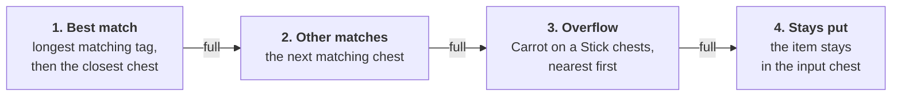

# GemsSorting

Item-frame driven chest sorting for our Paper 26.3 server: put an item frame on a chest, and the item inside
the frame decides what the chest does. A printable version of the player guide is in
[docs/Sorting-System-Guide.pdf](docs/Sorting-System-Guide.pdf) (source: [`docs/guide.html`](docs/guide.html)).

- [Player guide](#player-guide)
- [How it works](#how-it-works)
- [Configuration](#configuration)
- [Development](#development)

## Player guide

### The three chest types

Place an **item frame on a chest** and put one of these items in the frame. The item decides what the chest does.

| | Chest | Frame holds | What it does |
|:-:|---|---|---|
|  | **Input chest** | an **Eye of Ender** | Anything you put in here is sorted **instantly**. It works with items dropped in by hand, hoppers and droppers. |
|  | **Receiver chest** | a **Name Tag** named `#code` | Collects every item with *code* in its name. For example `#Sapling` collects all saplings. |
|  | **Overflow chest** | a **Carrot on a Stick** | Gets the leftovers: items with no matching name tag, and items whose tagged chests are full. |

### Setting it up

1. **Place the input chest.** Put an item frame on one of its sides (sneak and right-click the chest) and put
   an **Eye of Ender** in the frame.
2. **Name a Name Tag in an anvil** so it starts with `#`, for example `#Sapling`, `#Log` or `#Diamond`.
3. **Place the receiver chests** within **128 blocks** of the input chest. Put a frame on each one with its
   named tag inside.
4. **Place at least one overflow chest** with a **Carrot on a Stick** in its frame, so unmatched items have
   somewhere to go.
5. **Drop items into the input chest.** They are sent out right away.

> [!NOTE]
> **Without an overflow chest**, items that don't match any tag stay in the input chest. Nothing is lost or deleted.

### Naming the tags

The text after `#` is looked up inside the item's name. Upper and lower case don't matter.

| Tag | Collects |
|---|---|
| `#Sapling` | Oak Sapling, Birch Sapling, Cherry Sapling, … (every sapling) |
| `#Oak Sapling` | Only Oak Sapling (Dark Oak Sapling too, since its name contains "Oak Sapling") |
| `#Log` | Every log, including stripped logs |
| `#Diamond` | Diamond, Diamond Block, Diamond Ore, Diamond Sword, Diamond Pickaxe, … |
| `#Seeds` | Wheat Seeds, Pumpkin Seeds, Melon Seeds, Beetroot Seeds, … |

> [!TIP]
> **Use the English item names.** If your game is set to another language, use the English name or the item ID
> instead. Press **F3 + H** to show item IDs when you hover over items. For example, `#oak_sapling` works the
> same as `#Oak Sapling`. Items renamed in an anvil are sorted by their **original** name.

### Where each item goes



**Example:** you have a `#Oak` chest and a `#Sapling` chest. An Oak Sapling matches both, and it goes to
`#Sapling` because that tag is longer. Oak Logs and Oak Planks go to `#Oak`.

### Good to know

- **Range:** receiver and overflow chests must be within **128 blocks** of the input chest.
- **Stay nearby:** far-away chests in areas that aren't loaded are skipped. Their items go to the overflow
  chest instead.
- **Double chests** work. The frame can go on either half.
- Trapped chests and glow item frames work too. The frame can go on any side of the chest, including the top.
- You can have **several input chests**, and several chests with the same tag. When one fills up, the next one
  takes over.
- Changes to frames take up to **3 seconds** to take effect.
- Don't put an Eye of Ender on a receiver chest: that turns it into an input chest, and nothing gets sorted
  into it.
- **Nothing sorts?** Check that the name tag starts with `#` and was renamed in an anvil, that the frame is on
  the chest itself, and that the chest is within 128 blocks.

## How it works

- Anything that may put items into a chest (click, drag, closing the inventory, hoppers, droppers, hopper
  minecarts) schedules a sort of that chest for the next tick. The chest is sorted only if it has an
  Eye of Ender frame.
- Matching is a case-insensitive substring of the item's English name or its id (`oak_sapling`); anvil
  names are ignored.
- Targets are ordered by tag length (longest first), then by distance from the input chest. A full chest
  spills over to the next target, then to the overflow chests (nearest first); what is left stays in the
  input chest.
- The scan of frames around an input chest is cached for about 3 seconds. Only loaded chunks are scanned.

## Configuration

`plugins/GemsSorting/config.yml`:

| Key | Default | Meaning |
|---|---|---|
| `radius` | `128` | Max distance (blocks) from an input chest to its receiver and overflow chests |

## Development

### Code layout

| File | What it does |
|---|---|
| `GemsSortingPlugin.java` | Entry point; reads `config.yml` |
| `SortingListener.java` | Inventory events (click, drag, close, hopper move); schedules a sort of the touched chest |
| `SortingService.java` | Finds input, receiver and overflow chests via item frames and moves the items |
| `ItemNames.java` | Parses `#code` name tags and matches item names |

### Build

Requirements: **JDK 25** (the Paper 26.3 API is compiled for Java 25; the plugin itself targets Java 21)
and Maven 3.9+.

```sh
mvn -DskipTests clean package
```

Without a local JDK, use Docker:

```sh
docker run --rm -u "$(id -u):$(id -g)" -v "$PWD":/src -v "$HOME/.m2":/m2 -w /src \
  maven:3.9-eclipse-temurin-25 \
  mvn -Duser.home=/tmp -Dmaven.repo.local=/m2/repository -DskipTests clean package
```

Output: `target/gems-sorting-<version>.jar`.

### Player guide PDF

After editing `docs/guide.html`, regenerate the PDF with headless Chrome. The DejaVu fonts are mounted so
that bold text renders:

```sh
docker run --rm -u "$(id -u):$(id -g)" -v "$PWD/docs":/docs \
  -v /usr/share/fonts/truetype/dejavu:/usr/share/fonts/dejavu:ro \
  --entrypoint chromium-browser zenika/alpine-chrome:124 \
  --headless --no-sandbox --disable-gpu --no-pdf-header-footer \
  --print-to-pdf=/docs/Sorting-System-Guide.pdf file:///docs/guide.html
```

### Releasing a new version

1. Bump `<version>` in `pom.xml` and add an entry to `CHANGELOG.md`.
2. Build, then copy the jar to `release/gems-sorting-<version>.jar`. Released jars are kept in the repo so
   anyone can deploy without building.
3. Commit, tag and push: `git commit -am "Release x.y.z"`, `git tag vx.y.z`, `git push --follow-tags`.
4. Deploy: rename the old jar in `/plugins` to `.bak` (never overwrite a loaded jar), upload the new one, and
   restart the server when no one is playing.

Up to 1.0.0 the plugin was called **WsSorting** (`ws-sorting-1.0.0.jar`, config in `plugins/WsSorting/`).
When replacing it with GemsSorting, remove the old jar and move `plugins/WsSorting/config.yml` to
`plugins/GemsSorting/config.yml` before starting the server.
